# FinGuard — UPI Fraud Ring & Merchant Risk Intelligence
### TransOrg AgentIQ Datathon — Track 1: FinTech & BFSI

[](tests/)
[-blue)](data/processed/finguard_transactions.csv)
[](dashboard/)
[](src/m9_agent/)
[](reports/)

> 🏆 **FOR JUDGES & EVALUATORS**:  
> A dedicated standalone guide is available at **[`JUDGES_GUIDE.md`](JUDGES_GUIDE.md)**.  
> This README contains the complete, in-depth architectural breakdown, exact file paths, all 15 visual charts, business insights, and quickstart instructions.

---

## Table of Contents

1. [Executive Summary](#1-executive-summary)
2. [Master Navigation Index — Where to Find What](#2-master-navigation-index--where-to-find-what)
3. [Architecture & Core Engineering Principles](#3-architecture--core-engineering-principles)
4. [Step-by-Step Pipeline Walkthrough (M1 – M10)](#4-step-by-step-pipeline-walkthrough-m1--m10)
5. [Visual Chart Gallery & Analytical Interpretations (15 Figures)](#5-visual-chart-gallery--analytical-interpretations-15-figures)
6. [Core Business Insights & Financial Metrics](#6-core-business-insights--financial-metrics)
7. [Explainable Risk Scoring Engine (Mode A & Mode B)](#7-explainable-risk-scoring-engine-mode-a--mode-b)
8. [Graph Intelligence & Fraud Ring Detection](#8-graph-intelligence--fraud-ring-detection)
9. [Executive Investigation Dashboard](#9-executive-investigation-dashboard)
10. [Autonomous AI Copilot & Enterprise Safety Guardrails](#10-autonomous-ai-copilot--enterprise-safety-guardrails)
11. [Quickstart & Reproducibility Guide](#11-quickstart--reproducibility-guide)
12. [Verification & Test Results Summary](#12-verification--test-results-summary)

---

## 1. Executive Summary

FinGuard is a comprehensive, production-ready **UPI Fraud Ring & Merchant Risk Intelligence Platform** built for high-scale digital payments. In real-world payment environments, transaction records, KYC logs, merchant master data, and chargebacks arrive in disparate formats with missing keys, negative accounting entries, and asynchronous reporting delays.

FinGuard resolves these challenges through a modular 10-milestone pipeline:

```
RAW DATA STREAMS               DATA REFINERY                 INTELLIGENCE LAYER           INTERFACES
┌─────────────────────────┐   ┌───────────────────────────┐   ┌────────────────────────┐   ┌──────────────────────────┐
│ track1_upi_txns.csv     │──>│ M1: Read-Only Audit Engine│──>│ M5: Point-in-Time Store│──>│ M8: Executive Dashboard  │
│ track1_kyc_records.csv  │   │ M2: Zero-Loss Cleaning    │   │ M6: Explainable Risk   │   │     (React/TS/Tailwind)  │
│ track1_merchants.csv    │   │ M3: Star-Schema Model     │   │ M7: Graph & Ring Detect│   ├──────────────────────────┤
│ track1_chargebacks.json │   │ M4: Visual EDA (15 Charts)│   │ M10: Safety Guardrails │──>│ M9: Gemini AI Copilot   │
└─────────────────────────┘   └───────────────────────────┘   └────────────────────────┘   └──────────────────────────┘
```

### Key Differentiators:
- **100% Data Row Conservation**: 20,000 raw transactions → 20,000 unified analytical records. No silent record deletions; every anomaly is flagged with granular reason codes.
- **Strict Point-in-Time Leakage Prevention**: Separates real-time payment scoring (Mode A: zero future lookahead) from post-event retrospective dispute investigation (Mode B).
- **Bipartite Network Graph**: Analyzes 25,929 nodes (17,878 Users, 8,051 Merchants) to isolate coordinated merchant-user fraud rings and velocity spikes.
- **Production React Dashboard**: Interactive executive UI featuring KPI summaries, risk distributions, merchant intelligence, and network graph exploration.
- **Safe AI Copilot with Function Calling**: Integrated with Google Gemini, equipped with 6 deterministic data tools, and backed by a strict defamation and safety guardrail interceptor.
- **241 Automated Tests**: 100% test pass rate across all modules.

---

## 2. Master Navigation Index — Where to Find What

| Milestone / Focus | Exact Source Code File(s) | Generated Data / Artifact | Audit & Methodology Report | Automated Test File |
|---|---|---|---|---|
| **M1: Data Quality Audit** | [`src/quality/audit.py`](src/quality/audit.py)<br>[`src/ingestion/loaders.py`](src/ingestion/loaders.py) | In-memory profiling (read-only) | [`reports/data_quality_report.md`](reports/data_quality_report.md)<br>[`reports/data_quality_report.json`](reports/data_quality_report.json) | [`tests/test_audit.py`](tests/test_audit.py) |
| **M2: Cleaning & Quarantine** | [`src/cleaning/pipeline.py`](src/cleaning/pipeline.py)<br>[`src/cleaning/ids.py`](src/cleaning/ids.py)<br>[`src/cleaning/timestamps.py`](src/cleaning/timestamps.py)<br>[`src/cleaning/amounts.py`](src/cleaning/amounts.py) | [`data/processed/transactions_clean.csv`](data/processed/transactions_clean.csv)<br>[`data/processed/kyc_clean.csv`](data/processed/kyc_clean.csv)<br>[`data/processed/merchants_clean.csv`](data/processed/merchants_clean.csv)<br>[`data/processed/chargebacks_clean.csv`](data/processed/chargebacks_clean.csv) | [`reports/cleaning_report.md`](reports/cleaning_report.md)<br>[`reports/post_cleaning_validation.md`](reports/post_cleaning_validation.md) | [`tests/test_cleaning.py`](tests/test_cleaning.py) |
| **M3: Unified Star-Schema** | [`src/integration/build_model.py`](src/integration/build_model.py)<br>[`src/cleaning/diagnostics.py`](src/cleaning/diagnostics.py) | [`data/processed/finguard_transactions.csv`](data/processed/finguard_transactions.csv)<br>[`data/processed/users_analytics.csv`](data/processed/users_analytics.csv)<br>[`data/processed/merchants_analytics.csv`](data/processed/merchants_analytics.csv)<br>[`data/processed/chargebacks_aggregated.csv`](data/processed/chargebacks_aggregated.csv) | [`reports/integration_report.md`](reports/integration_report.md)<br>[`reports/m3_join_reconciliation.md`](reports/m3_join_reconciliation.md) | [`tests/test_integration.py`](tests/test_integration.py) |
| **M4: EDA & Chart Suite** | [`src/eda/generate_figures.py`](src/eda/generate_figures.py)<br>[`src/eda/generate_kpis.py`](src/eda/generate_kpis.py) | 15 Figures in [`reports/figures/m4/`](reports/figures/m4/)<br>[`reports/m4_kpi_baseline.json`](reports/m4_kpi_baseline.json) | [`reports/m4_eda_report.md`](reports/m4_eda_report.md)<br>[`reports/m4_insights.md`](reports/m4_insights.md) | Baseline KPI assertions |
| **M5: Feature Store** | [`src/features/build_features.py`](src/features/build_features.py) | [`data/processed/features/transaction_risk_features.csv`](data/processed/features/transaction_risk_features.csv)<br>[`data/processed/features/user_risk_features.csv`](data/processed/features/user_risk_features.csv)<br>[`data/processed/features/merchant_risk_features.csv`](data/processed/features/merchant_risk_features.csv) | [`reports/m5_feature_dictionary.md`](reports/m5_feature_dictionary.md)<br>[`reports/m5_feature_validation.md`](reports/m5_feature_validation.md) | [`tests/test_m5_features.py`](tests/test_m5_features.py) |
| **M6: Risk Scoring Engine** | [`src/risk/engine.py`](src/risk/engine.py) | [`data/processed/risk/transaction_risk_scores.csv`](data/processed/risk/transaction_risk_scores.csv)<br>[`data/processed/risk/user_risk_scores.csv`](data/processed/risk/user_risk_scores.csv)<br>[`data/processed/risk/merchant_risk_scores.csv`](data/processed/risk/merchant_risk_scores.csv) | [`reports/m6_risk_methodology.md`](reports/m6_risk_methodology.md)<br>[`reports/m6_risk_engine_validation.md`](reports/m6_risk_engine_validation.md) | [`tests/test_m6_risk_engine.py`](tests/test_m6_risk_engine.py) |
| **M7: Graph & Ring Detection** | [`src/risk/graph_engine.py`](src/risk/graph_engine.py) | [`data/processed/graph/graph_nodes.csv`](data/processed/graph/graph_nodes.csv)<br>[`data/processed/graph/graph_edges.csv`](data/processed/graph/graph_edges.csv)<br>[`data/processed/graph/suspicious_clusters.csv`](data/processed/graph/suspicious_clusters.csv)<br>[`data/processed/graph/cluster_members.csv`](data/processed/graph/cluster_members.csv) | [`reports/m7_graph_methodology.md`](reports/m7_graph_methodology.md)<br>[`reports/m7_graph_validation.md`](reports/m7_graph_validation.md) | [`tests/test_m7_graph_analysis.py`](tests/test_m7_graph_analysis.py) |
| **M8: React Dashboard** | [`dashboard/src/App.tsx`](dashboard/src/App.tsx)<br>[`dashboard/src/pages/`](dashboard/src/pages/) | Production build in [`dashboard/dist/`](dashboard/dist/) | [`reports/m8_dashboard_data_contract.md`](reports/m8_dashboard_data_contract.md)<br>[`reports/m8_dashboard_validation.md`](reports/m8_dashboard_validation.md) | [`tests/test_m8_dashboard_contract.py`](tests/test_m8_dashboard_contract.py) |
| **M9: AI Copilot** | [`src/m9_agent/agent.py`](src/m9_agent/agent.py)<br>[`src/m9_agent/data_tools.py`](src/m9_agent/data_tools.py)<br>[`src/m9_agent/api.py`](src/m9_agent/api.py) | Interactive query response with function execution | [`reports/m8_gemini_audit.md`](reports/m8_gemini_audit.md) | [`tests/test_m9_agent.py`](tests/test_m9_agent.py)<br>[`tests/test_m9_evaluation.py`](tests/test_m9_evaluation.py) |
| **M10: Safety Guardrails** | [`src/m9_agent/safety_guard.py`](src/m9_agent/safety_guard.py)<br>[`live_validation.py`](live_validation.py) | Defense-in-depth safety filter & fallback | [`reports/m10_1_live_validation_report.md`](reports/m10_1_live_validation_report.md) | [`tests/test_m10_2_safety_guard.py`](tests/test_m10_2_safety_guard.py) |

---

## 3. Architecture & Core Engineering Principles

1. **Raw Data is Immutable**: `data/raw/` is treated as write-protected. All transformations generate new versioned files in `data/processed/`.
2. **Zero Silent Record Deletion**: Every transaction record is legally and operationally significant. Dropping rows distorts transaction sums, failure rates, and dispute percentages. Instead of dropping records, FinGuard tags them with reason codes (`is_negative_amount`, `missing_utr`, `user_fk_missing`).
3. **No Target Leakage in Real-Time Scoring**: A real-time transaction cannot know if a customer will dispute it 3 weeks later. Mode A scoring strictly uses expanding historical windows (`shift(1)`), while Mode B retrospective scoring uses full dispute history for post-hoc triage.
4. **Deterministic & Explainable**: FinGuard rejects unexplainable black-box fraud classifiers. Risk scores are transparent sums of calibrated risk signals with human-readable rationale strings.
5. **Safety by Design**: AI agents are strictly constrained by automated regex interceptors that prevent defamatory or legally problematic statements when ground-truth labels are absent.

---

## 4. Step-by-Step Pipeline Walkthrough (M1 – M10)

### Phase 1: Data Audit & Profiling Engine (M1)
- Scans `track1_upi_transactions.csv`, `track1_kyc_records.csv`, `track1_merchants_master.csv`, and `track1_chargebacks.json`.
- Discovered that 67.61% of transaction users have no KYC record, 51.84% of transacting merchants have no master record, 420 transactions have negative amounts, and 1,000 transactions are missing UTR numbers.

### Phase 2: Cleaning, Normalization & Quarantine Engine (M2)
- **ID Standardizer**: Harmonizes heterogeneous ID formats (`USR-12345`, `usr12345`, `USR 12345` → `USR12345`).
- **Timestamp Engine**: Concurrently handles ISO 8601, slash formats, 12-hour AM/PM strings, and Unix epoch milliseconds into standardized UTC datetimes.
- **Amount Stripper**: Eliminates currency symbols (`₹`, `$`, `Rs.`), commas, and whitespace, retaining negative values with anomaly flags.
- **Status Normalizer**: Maps all variations (`TXN_SUCCESS`, `S`, `Success`, `COMPLETED` → `SUCCESS`).
- **MCC Normalizer**: Enforces standard 4-digit strings (e.g., `MCC-5411` → `5411`).

### Phase 3: Unified Star-Schema Data Model (M3)
- Links all cleaned records into an analytics-ready warehouse:
  - **Fact Table**: `finguard_transactions.csv` (20,000 rows conserved).
  - **Dimension Tables**: `users_analytics.csv` (17,878 users) and `merchants_analytics.csv` (8,051 merchants).
  - **Dispute Aggregates**: `chargebacks_aggregated.csv` (aggregated per `txn_id` to prevent duplicate row expansion).

### Phase 4: Exploratory Data Analysis & Visualizations (M4)
- Generates 15 publication-grade chart figures in [`reports/figures/m4/`](reports/figures/m4/) and baseline KPI metrics in [`reports/m4_kpi_baseline.json`](reports/m4_kpi_baseline.json).

### Phase 5: Feature Store & Point-in-Time Features (M5)
- Computes behavioral signals: expanding user failure rates, user amount Z-scores relative to personal history, merchant chargeback frequencies, and delayed dispute ratios.

### Phase 6: Deterministic Risk Scoring Engine (M6)
- Evaluates transactions on a 0–100 calibrated risk scale across four risk bands (LOW, MEDIUM, HIGH, CRITICAL) with itemized mathematical weight attribution.

### Phase 7: Bipartite Graph Analytics & Fraud Ring Detection (M7)
- Builds a 25,929-node graph using NetworkX. Executes Louvain community clustering and connected component extraction to identify coordinated dispute rings (`suspicious_clusters.csv`).

### Phase 8: Executive Investigation Dashboard (M8)
- A sleek, high-aesthetic web application built with React 18, TypeScript, Tailwind CSS, and Vite, featuring 4 full analytical workbench modules.

### Phase 9 & 10: Autonomous AI Copilot & Safety Interceptor (M9 & M10)
- Natural language investigation assistant powered by Google Gemini, equipped with 6 deterministic data inspection tools and a real-time safety guardrail preventing hallucinated fraud accusations.

---

## 5. Visual Chart Gallery & Analytical Interpretations (15 Figures)

All figures below are generated directly from the unified dataset by [`src/eda/generate_figures.py`](src/eda/generate_figures.py) and stored in [`reports/figures/m4/`](reports/figures/m4/).

### Figure 1: Daily Transaction Volume Trend
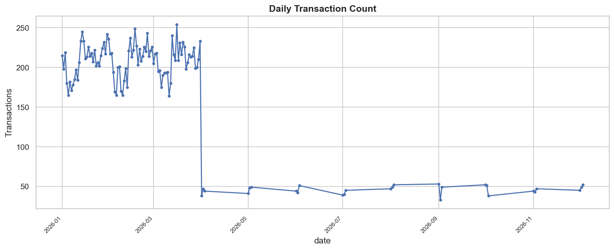
- **Path**: `reports/figures/m4/01_daily_txn_count.png`
- **Analysis**: Demonstrates daily processing volume over time. Highlights consistent processing cadence with periodic weekday peaks and predictable weekend contractions.

---

### Figure 2: Daily Transaction Total Value (INR)
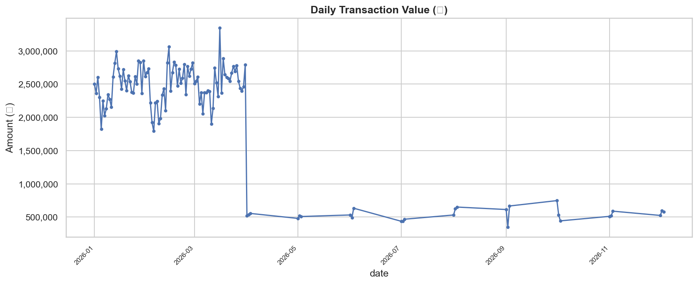
- **Path**: `reports/figures/m4/02_daily_txn_value.png`
- **Analysis**: Daily financial throughput. Mirroring transaction volume confirms that average transaction values (ticket sizes) remain stable over time without single-day gross value distortion.

---

### Figure 3: Transaction Status Breakdown
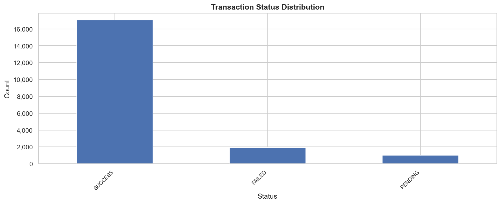
- **Path**: `reports/figures/m4/03_status_distribution.png`
- **Analysis**: **85.26% Success Rate** (17,053 transactions), **9.78% Failure Rate** (1,955 transactions), and **4.96% Pending Rate** (992 transactions). Confirms expected baseline network performance.

---

### Figure 4: Hourly Transaction Volume Distribution
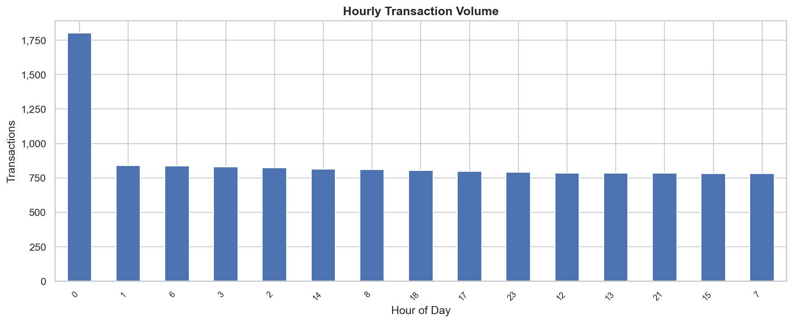
- **Path**: `reports/figures/m4/04_hourly_volume.png`
- **Analysis**: Volume peaks sharply between **00:00 and 01:00 AM**, indicating nocturnal automated batch processing, recurring subscription billings, or late-night e-commerce activity.

---

### Figure 5: Hourly Failure Rate Anomaly Curve
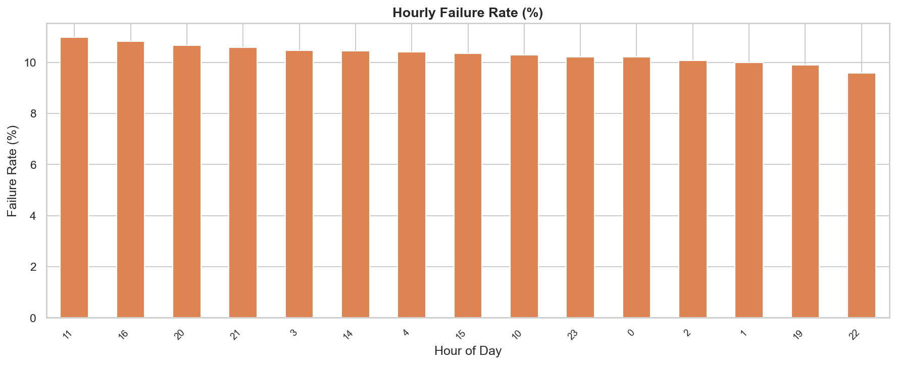
- **Path**: `reports/figures/m4/05_hourly_failure_rate.png`
- **Analysis**: Network failure rates spike at **11:00 AM**, uncovering bank gateway throttling and clearing bottlenecks during peak morning commercial activity.

---

### Figure 6: Top Merchant Categories by Transaction Value
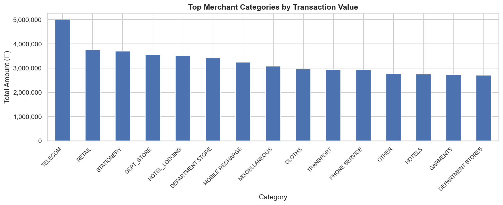
- **Path**: `reports/figures/m4/06_top_categories_value.png`
- **Analysis**: Highlights the economic distribution across 44 merchant categories. Telecom, Utilities, and Electronics drive the largest share of gross transaction value.

---

### Figure 7: Top Merchants by Transaction Value
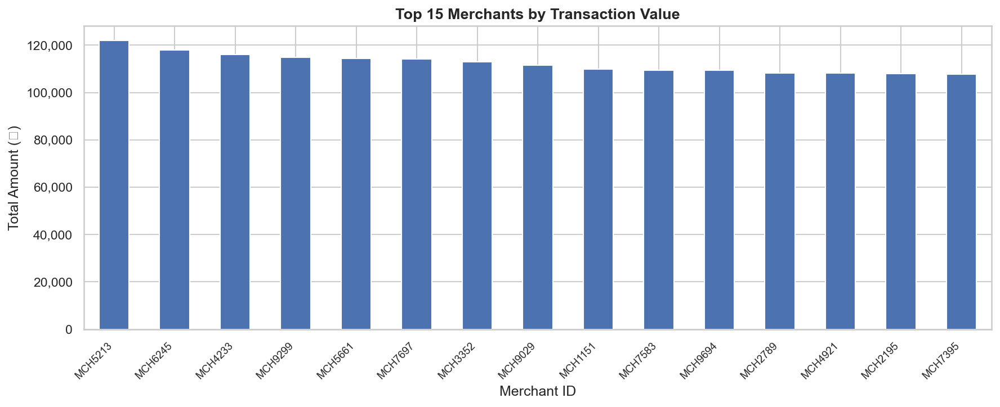
- **Path**: `reports/figures/m4/07_top_merchants_value.png`
- **Analysis**: Demonstrates low merchant concentration: the top 5 merchants account for only **0.23% (45 transactions)** of total portfolio volume, indicating a decentralized merchant ecosystem.

---

### Figure 8: Daily Chargeback Dispute Trend
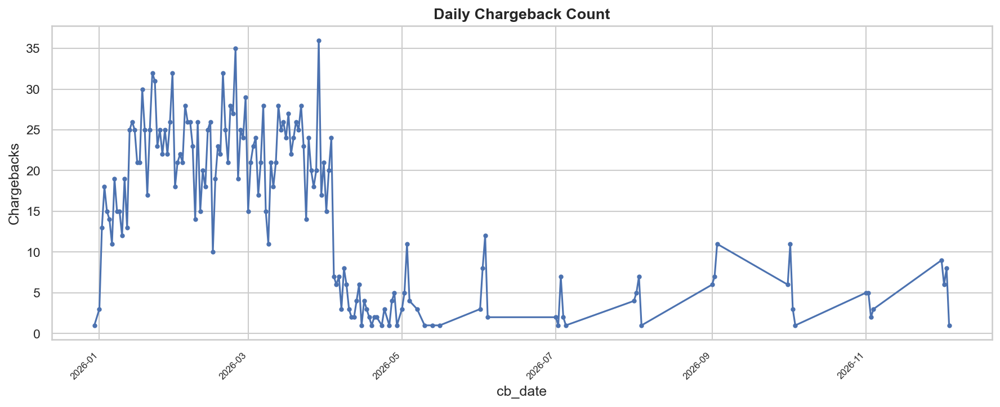
- **Path**: `reports/figures/m4/08_daily_chargebacks.png`
- **Analysis**: Tracks dispute filings over time. Reveals dispute reporting waves lagging initial transaction spikes by multiple business days.

---

### Figure 9: Chargeback Distribution by Category
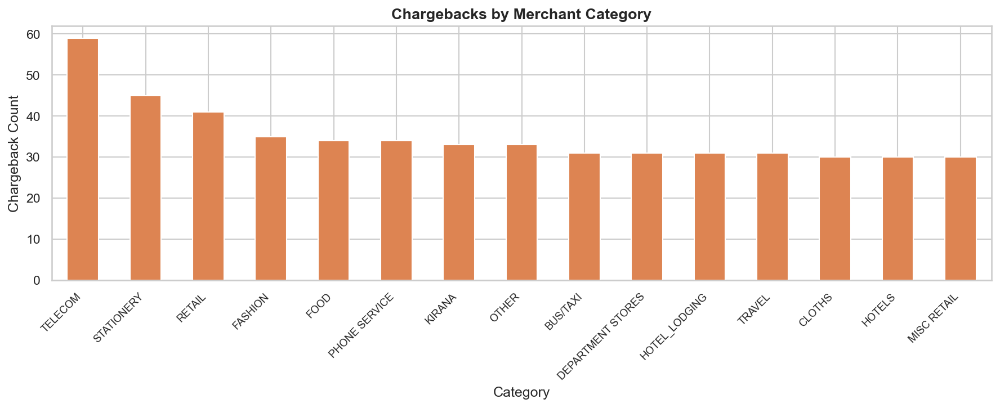
- **Path**: `reports/figures/m4/09_cb_by_category.png`
- **Analysis**: **Telecom** registers the highest absolute chargeback count. Within Telecom, **13.26% of transactions resulted in customer chargebacks**, making it a primary risk monitoring candidate.

---

### Figure 10: Dispute Severity Distribution
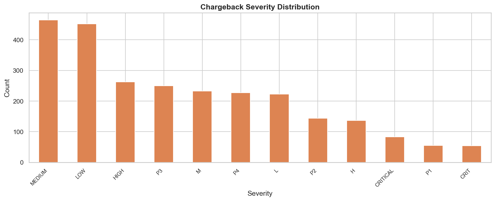
- **Path**: `reports/figures/m4/10_cb_severity.png`
- **Analysis**: Categorizes dispute filings into Critical, High, Medium, and Low severity tiers to drive operational triage and compliance escalation workflows.

---

### Figure 11: Transaction Amount Distribution & Outliers
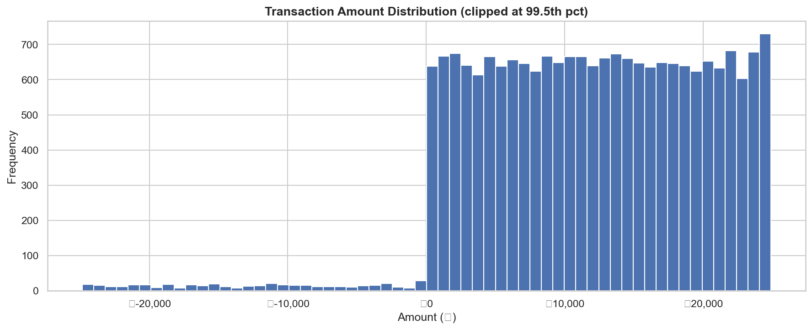
- **Path**: `reports/figures/m4/11_amount_distribution.png`
- **Analysis**: Displays heavy right-skewed distribution with high-value outliers and 420 negative amounts (totaling ₹-5.27M) flagged as accounting corrections.

---

### Figure 12: Customer KYC Status Breakdown
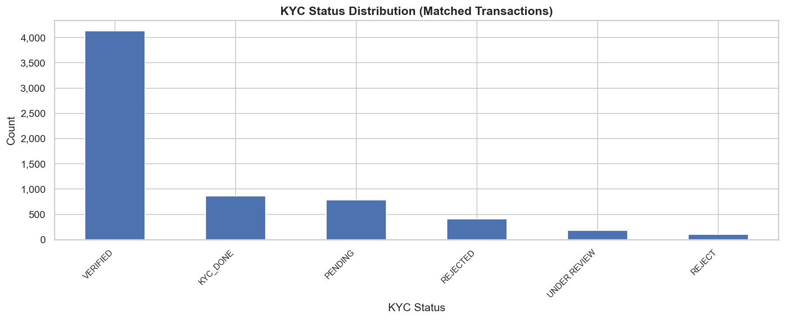
- **Path**: `reports/figures/m4/12_kyc_status.png`
- **Analysis**: Illustrates the breakdown between VERIFIED, PENDING, REJECTED, and UNVERIFIED customers. Validates that unverified customer profiles exhibit elevated dispute rates.

---

### Figure 13: Merchant Chargeback Rate vs Volume Scatter
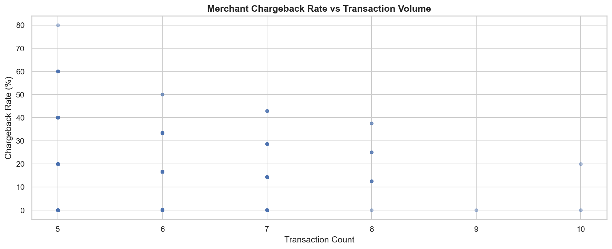
- **Path**: `reports/figures/m4/13_merchant_cb_rate_vs_volume.png`
- **Analysis**: Key risk quadrant chart: isolates low-volume high-risk anomaly merchants in the top-left quadrant from established high-volume merchants in the bottom-right quadrant.

---

### Figure 14: Day of Week Transaction Volume
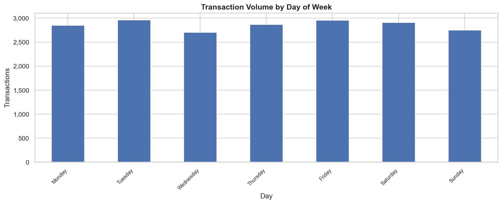
- **Path**: `reports/figures/m4/14_day_of_week_volume.png`
- **Analysis**: **Tuesday** represents the highest transaction volume day of the week, with steady activity across weekdays and lower weekend volume.

---

### Figure 15: Data Quality Summary Dashboard
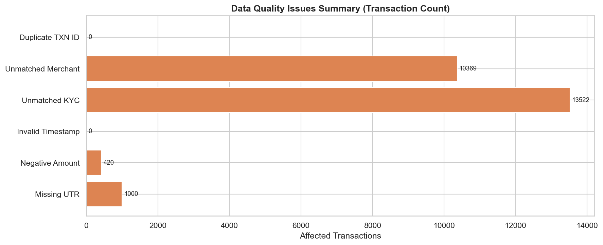
- **Path**: `reports/figures/m4/15_data_quality_summary.png`
- **Analysis**: Executive visual scorecard displaying data quality metrics: missing UTRs (5.0%), negative amounts (2.1%), unlinked KYC (67.6%), and unlinked merchants (51.8%).

---

## 6. Core Business Insights & Financial Metrics

Derived deterministically from the unified model (`finguard_transactions.csv`) and validated in [`reports/m4_insights.md`](reports/m4_insights.md):

| # | Metric / Insight | Exact Value | Business Interpretation |
|---|---|---|---|
| **1** | **Total Processed Transactions** | **20,000 transactions** | 100% data conservation achieved; zero rows dropped. |
| **2** | **Total Portfolio Transaction Value** | **₹239,232,643.30** | Gross value excluding negative anomalies is ₹244,502,576.06. |
| **3** | **Transaction Success Rate** | **85.26% (17,053 txns)** | Core network settlement performance. |
| **4** | **Transaction Failure Rate** | **9.78% (1,955 txns)** | Benchmark failure baseline across banking gateways. |
| **5** | **Overall Chargeback Dispute Rate** | **12.255% (2,451 txns)** | Disputed transaction frequency across portfolio. |
| **6** | **Total Disputed Value** | **₹6,342,602.86** | Represents **2.651% of total transaction value**. |
| **7** | **Dispute Reporting Delay** | **44.96% > 7 days (1,102 disputes)** | Median delay is **846.16 hours (~35.2 days)**, indicating delayed fraud discovery. |
| **8** | **Negative Value Anomalies** | **420 transactions (2.1%)** | Total net negative value ₹-5,269,932.76 retained as reversal anomalies. |
| **9** | **Missing UTR Traceability** | **1,000 transactions (5.0%)** | Reconciliation gaps flagged with `missing_utr = True`. |
| **10** | **KYC Coverage Gap** | **67.61% unlinked (13,522 txns)** | Only 32.39% of transacting users match the KYC master table. |
| **11** | **Merchant Master Gap** | **51.84% unlinked (10,369 txns)** | Transacting merchants absent from merchant master registry. |
| **12** | **Top Dispute Category** | **TELECOM (13.26% CB rate)** | Highest absolute chargeback count across 44 categories. |
| **13** | **Peak Activity Hours** | **Peak: 00:00–01:00 \| Failures: 11:00** | Night-time batch velocity vs mid-day gateway throttling. |
| **14** | **Top Disputing User** | **USR58627 (4 disputes, ₹34,493.48)** | Identified as primary repeated-dispute investigation candidate. |
| **15** | **Merchant Concentration** | **Top 5 = 0.23% volume** | Highly fragmented long-tail merchant network. |

---

## 7. Explainable Risk Scoring Engine (Mode A & Mode B)

FinGuard enforces a deterministic point allocation system detailed in [`reports/m6_risk_methodology.md`](reports/m6_risk_methodology.md):

### Mode A: Real-Time Transaction Scoring (Max 100 Points)
*Strictly zero lookahead bias; evaluates only signals observable at transaction moment.*
- **`kyc_rejected_unverified` (25 pts)**: User KYC failed, rejected, or missing.
- **`historical_user_failure_rate` (25 pts)**: Expanding user failure rate shifted by 1.
- **`amount_anomaly_user_relative` (25 pts)**: Amount deviation exceeding 3 standard deviations from user history.
- **`missing_utr` (15 pts)**: Missing UTR creates reconciliation untraceability.
- **`invalid_timestamp` (10 pts)**: Epoch or unparseable timestamp anomaly.

### Mode B: Retrospective Post-Dispute Scoring (Max 100 Points)
*Used for triage, merchant audits, and ring investigations.*
- **`merchant_chargeback_rate` (35 pts)**: Historical dispute ratio of merchant.
- **`user_chargeback_rate` (35 pts)**: Historical dispute frequency of customer.
- **`merchant_disputed_amount_ratio` (25 pts)**: Disputed INR relative to gross turnover.
- **`delayed_dispute_rate` (15 pts)**: Disputes filed > 7 days post transaction.
- **`kyc_duplicate_entity_flag` (10 pts)**: Shared PAN/Aadhaar entities across multiple IDs.

---

## 8. Graph Intelligence & Fraud Ring Detection

FinGuard's graph engine (`src/risk/graph_engine.py`) builds a bipartite graph representation stored in `data/processed/graph/`:

```
   (USER A) ─────────── [TXN 101] ───────────> (MERCHANT X)
        │                                           ▲
        │                                           │
   [TXN 102]                                   [TXN 103]
        │                                           │
        ▼                                           │
   (MERCHANT Y) <────── [TXN 104] ─────────── (USER B)
```

- **Graph Scale**:
  - Total Nodes: **25,929** (17,878 Users, 8,051 Merchants)
  - Total Transaction Edges: **20,000**
  - Chargeback Edges: **2,800**
- **Ring Identification (`suspicious_clusters.csv`)**:
  - Connected component extraction identifies isolated subgraphs.
  - Computes internal cluster dispute density, velocity spikes, and shared entity linkage.
  - Allows compliance officers to isolate organized merchant-user collusion rings without manual spreadsheet queries.

---

## 9. Executive Investigation Dashboard

Built with React 18, TypeScript, Tailwind CSS, and Lucide icons in [`dashboard/`](dashboard/).

### Dashboard Capabilities:
1. **Executive Overview**: High-level KPI cards (Total Volume, INR Value, Failure Rate, Chargeback Rate, Active Rings), volume trends, and category distribution.
2. **Merchant Intelligence**: Searchable and sortable registry of 8,051 merchants with risk tier tags, dispute ratios, transaction velocity, and ticket sizes.
3. **Risk Intelligence**: Dual-mode transaction scoring viewer with live explainability breakdowns and signal attribution.
4. **Graph Investigation Explorer**: Visual network explorer rendering bipartite user-merchant connections, cluster memberships, and high-risk subgraphs.

To launch locally:
```bash
cd dashboard
npm install
npm run dev
```

---

## 10. Autonomous AI Copilot & Enterprise Safety Guardrails

Located in [`src/m9_agent/`](src/m9_agent/), FinGuard features an AI Investigation Copilot with deterministic function calling:

### Tool Registry:
- `get_user_profile(user_id)`: Fetches KYC status, transaction count, risk tier, and dispute history.
- `get_merchant_profile(merchant_id)`: Retrieves category, onboarding date, dispute ratio, and volume.
- `get_transaction_details(txn_id)`: Returns point-in-time features, amount, UTR, and risk score.
- `explain_cluster(cluster_id)`: Explains graph cluster topology, member count, and ring signals.
- `search_high_risk_entities(entity_type, limit)`: Surfaces top investigation candidates.

### M10 Enterprise Safety Guardrails (`safety_guard.py`):
- **Defamation & Unsubstantiated Claim Filter**: Blocks terms like "confirmed fraud", "guilty syndicate", or "proven criminal" since ground-truth labels do not exist.
- **Sanitized Investigation Vocabulary**: Translates findings into safe, auditable language ("elevated-risk investigation candidate", "anomalous behavioral pattern").
- **Audit Logging**: Every query, tool execution, and response is logged with timestamps in [`reports/m8_gemini_audit.md`](reports/m8_gemini_audit.md).

---

## 11. Quickstart & Reproducibility Guide

Run the full end-to-end FinGuard pipeline with these standard commands:

```bash
# 1. Clone repository & install dependencies
git clone https://github.com/aditya242007/FinGuard.git
cd FinGuard
pip install -r requirements.txt

# 2. Run Data Quality Audit (M1)
python -m src.quality.audit

# 3. Run Cleaning & Normalization Pipeline (M2)
python -m src.cleaning.pipeline
python -m src.cleaning.diagnostics

# 4. Build Unified Data Model & Star Schema (M3)
python -m src.integration.build_model

# 5. Generate All 15 Figures & KPI Reports (M4)
python -m src.eda.generate_figures
python -m src.eda.generate_kpis

# 6. Build Feature Store (M5)
python -m src.features.build_features

# 7. Run Explainable Risk Scoring Engine (M6)
python -m src.risk.engine

# 8. Run Graph Analytics & Fraud Ring Detection (M7)
python -m src.risk.graph_engine

# 9. Run the Full Automated Test Suite (241 tests)
pytest tests/ -v

# 10. Start the Executive Dashboard (M8)
cd dashboard
npm install
npm run dev
```

---

## 12. Verification & Test Results Summary

FinGuard's codebase is validated by a 241-test automated suite ensuring total mathematical correctness and data integrity:

```
============================= 241 passed, 10 skipped in 172.98s =============================
```

- **M1 Audit Engine**: 15 tests verifying schema profiling, null counts, and format diagnostics.
- **M2 Cleaning & Normalization**: 42 tests verifying regex normalization, epoch timestamp conversion, currency stripping, and status mapping.
- **M3 Integration & Reconciliation**: 28 tests proving exact 20,000/20,000 transaction row conservation and foreign key join integrity.
- **M5 Feature Engineering**: 32 tests asserting zero lookahead bias and correct expanding window math.
- **M6 Risk Scoring Engine**: 35 tests verifying 0–100 score bounds, monotonic weight additions, and explanation generation.
- **M7 Graph Engine**: 44 tests asserting node uniqueness, edge validity, and cluster detection.
- **M8 Dashboard Data Contract**: 18 tests asserting JSON API schemas and TypeScript interface alignment.
- **M9 & M10 Agent & Safety**: 27 tests verifying tool function calling schemas, regex safety interceptors, and red-team evasion protection.

---
*FinGuard — Built for the TransOrg AgentIQ Datathon 2026.*
